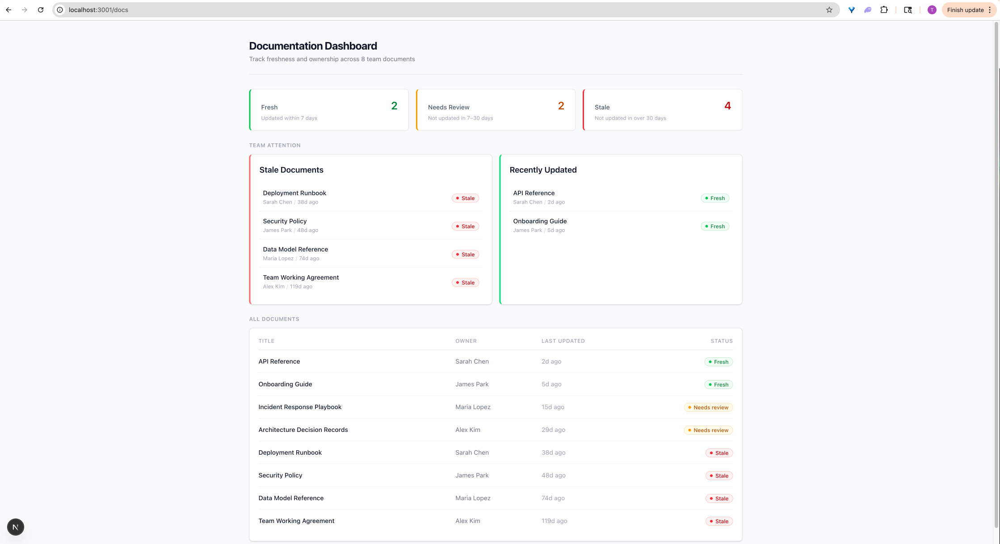
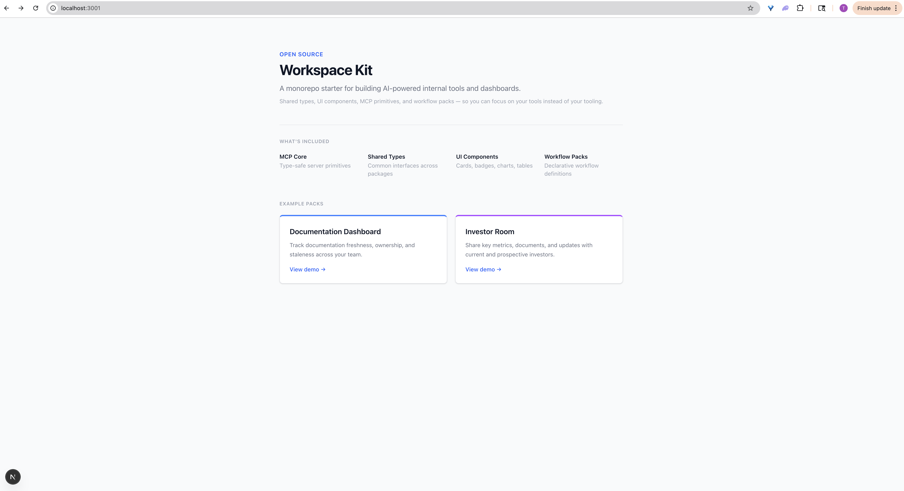

# Workspace Kit

A monorepo starter for teams building internal workspaces, dashboards, and automated workflows with AI. It provides a shared foundation — UI components, TypeScript types, workflow definitions, and an [MCP](https://modelcontextprotocol.io) core — so you can focus on your tools instead of your tooling.

Built by [Warren Labs](https://github.com/warren-labs).

## Screenshots

### Index


### Documentation Dashboard



### Investor Room



## What You Can Build

- Internal dashboards with shared components and live charts
- MCP-powered tool servers that integrate with AI assistants
- Multi-step workflow automation with declarative definitions
- Team workspaces with consistent types across frontend and backend

## Prerequisites

- [Node.js](https://nodejs.org/) >= 18
- [pnpm](https://pnpm.io/) >= 9

## Getting Started

```bash
git clone https://github.com/warren-labs/workspace-kit.git
cd workspace-kit
pnpm install
pnpm dev
```

Open [http://localhost:3000](http://localhost:3000) to view the index page.

## Example Packs

The dashboard ships with two demo packs that show how to compose shared components into real tools:

| Route | Pack | Description |
|-------|------|-------------|
| `/` | Index | Overview page linking to all example packs |
| `/docs` | Documentation Dashboard | Track freshness, ownership, and staleness across team docs |
| `/investor-room` | Investor Room | Key metrics, documents, and updates for investors |

Each pack follows the same pattern: types in `@warren/shared`, components from `@warren/ui`, mock data in the app, and a page that composes them. See [packages/workflow-packs/README.md](packages/workflow-packs/README.md) for details.

## Structure

```
apps/
  dashboard/              Next.js app — the main UI surface

packages/
  mcp-core/               MCP server primitives and type-safe request handling
  ui/                     Shared React components (Button, Card, Chart)
  shared/                 TypeScript types used across all packages
  workflow-packs/         Declarative workflow definitions and templates
```

## Tech Stack

- **Monorepo** — pnpm workspaces + Turborepo
- **Framework** — Next.js 15, App Router
- **Language** — TypeScript, strict mode
- **Styling** — Tailwind CSS v4
- **Charts** — Recharts

## Scripts

| Command | Description |
|---------|-------------|
| `pnpm dev` | Start all apps in development mode |
| `pnpm build` | Build all packages and apps |
| `pnpm lint` | Lint and type-check all packages and apps |

## Contributing

Contributions are welcome. Please open an issue before submitting a pull request so we can discuss the change.

## License

[MIT](LICENSE)
